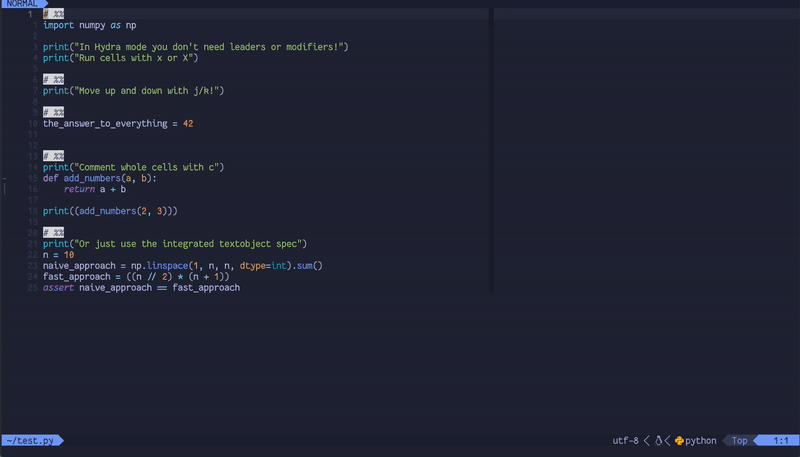

# 🚢 Notebook Navigator 🚢

Notebook Navigator lets you manipulate and send code cells to a REPL.

A great feature that comes on by default with VSCode is the ability to define
code cells and send them to a REPL like you would do in a Jupyter notebook but
without the hassle of notebook files. Notebook Navigator brings you back that
functionality and more!

Notebook Navigator comes with the following functions and features:
- Jump up/down between cells
- Run cells (with and without jumping to the next one)
- Create cells above/below the current one
- Split cells
- Comment whole cells
- A [mini.ai](https://github.com/echasnovski/mini.nvim/blob/main/readmes/mini-ai.md) textobject
  specification that you can use standalone
- A [Hydra](https://github.com/anuvyklack/hydra.nvim) mode to quickly manipulate and run
  cells
- Code cell marker highlighting
- Support for multiple languages. Notebooks are not just for Pythonistas!
- ... [and more](#full-api)

This plugin also pairs really well with tools like Jupytext that allow you to
convert easily between `ipynb` and `py` files. For this you may want to use a
plugin such as [jupytext.nvim](https://github.com/GCBallesteros/jupytext.nvim).



This plugin is an evolution of my previous setup which you can find
[here](https://www.maxwellrules.com/misc/nvim_jupyter.html).

## What is a code cell?
A code cell is any code between a cell marker, usually a specially designated comment
and the next cell marker or the end of the buffer. The first line of a buffer has an
implicit cell marker before it.

For example here are a bunch of cells on a Python script
```python
print("Cell 1")
# %%
print("This is cell 2!")
# %%
print("This is the last cell!")
```


## Installation
Here is my [lazy.nvim](https://www.github.com/folke/lazy.nvim) specification for Notebook
Navigator.

I personally like to have the moving between cell commands and cell executing functions
available through leader keymaps but will turn to the Hydra head when many cells need to
be run (just by smashing `x`) or for less commonly used functionality.
```lua
{
  "GCBallesteros/NotebookNavigator.nvim",
  keys = {
    { "]h", function() require("notebook-navigator").move_cell "d" end },
    { "[h", function() require("notebook-navigator").move_cell "u" end },
    { "<leader>X", "<cmd>lua require('notebook-navigator').run_cell()<cr>" },
    { "<leader>x", "<cmd>lua require('notebook-navigator').run_and_move()<cr>" },
  },
  dependencies = {
    "echasnovski/mini.comment",
    "hkupty/iron.nvim", -- repl provider
    -- "akinsho/toggleterm.nvim", -- alternative repl provider
    -- "benlubas/molten-nvim", -- alternative repl provider
    "anuvyklack/hydra.nvim",
  },
  event = "VeryLazy",
  config = function()
    local nn = require "notebook-navigator"
    nn.setup({ activate_hydra_keys = "<leader>h" })
  end,
}
```

## Enabling Mini.hipatterns cell highlighting
The lines delimiting the code cells can have pretty highlighting if you install 
[mini.hipatterns](https://github.com/echasnovski/mini.hipatterns). To activate them you will
have to add an entry into the `highlighters` option of 'mini.hipatterns'. If you are using
[lazy.nvim](https//www.github.com/folke/lazy.nvim) `minihipatterns_spec` and your __only__
configuration was meant to activate cell highlighting then your 'mini.hipatterns' could
look like:

```lua
return {
  "echasnovski/mini.hipatterns",
  event = "VeryLazy",
  dependencies = { "GCBallesteros/NotebookNavigator.nvim" },
  opts = function()
    local nn = require "notebook-navigator"

    local opts = { highlighters = { cells = nn.minihipatterns_spec } }
    return opts
  end,
}
```

If you are after a more simple solution that doesn't require new plugins and looks
more minimal just set the `syntax_highlight` option to `true`.


## Mini.ai integration
The `miniai_spec` function is also a valid mini.ai textobject specification.
All you need to do to add it is to add the `custom_textobjects`  to your 'mini.ai' setup. If you
are using [layz.nvim](https://www.github.com/folke/lazy.nvim) and your __only__ configuration was
meant include the _code cell_ text object then your 'mini.ai' could look like:

```lua
return {
  "echasnovski/mini.ai",
  event = "VeryLazy",
  dependencies = { "GCBallesteros/NotebookNavigator.nvim" },
  opts = function()
    local nn = require "notebook-navigator"

    local opts = { custom_textobjects = { h = nn.miniai_spec } }
    return opts
  end,
}
```


## Detailed configuration
Any options that are not specified when calling `setup` will take on their default values.
```lua
{
  -- Code cell marker. Cells start with the marker and end either at the beginning
  -- of the next cell or at the end of the file.
  -- By default, uses language-specific double percent comments like `# %%`.
  -- This can be overridden for each language with this setting.
  cell_markers = {
    -- python = "# %%",
  },
  -- If not `nil` the keymap defined in the string will activate the hydra head.
  -- If you don't want to use hydra you don't need to install it either.
  activate_hydra_keys = nil,
  -- If `true` a hint panel will be shown when the hydra head is active. If `false`
  -- you get a minimalistic hint on the command line.
  show_hydra_hint = true,
  -- Mappings while the hydra head is active.
  -- Any of the mappings can be set to "nil", the string! Not the value! to unamp it
  hydra_keys = {
    comment = "c",
    run = "X",
    run_and_move = "x",
    move_up = "k",
    move_down = "j",
    add_cell_before = "a",
    add_cell_after = "b",
  },
  -- The repl plugin with which to interface
  -- Current options: "iron" for iron.nvim, "toggleterm" for toggleterm.nvim,
  -- "molten" for molten-nvim or "auto" which checks which of the above are 
  -- installed
  repl_provider = "auto",
  -- Syntax based highlighting. If you don't want to install mini.hipattners or
  -- enjoy a more minimalistic look
  syntax_highlight = false,
  -- (Optional) for use with `mini.hipatterns` to highlight cell markers
  cell_highlight_group = "Folded",
}
```

## Current limitations
If any key gets remapped or unmapped to a different key you will need to set `show_hydra_hint`
to `false`. See issue for more details.


## Dependencies
The currently supported REPLs are:
- [iron.nvim](https://github.com/Vigemus/iron.nvim),
- [toggleterm.nvim](https://github.com/akinsho/toggleterm.nvim) or
- [molten-nvim](https://github.com/benlubas/molten-nvim)

The latter are automatically detected. Support for others like `conjure`
or `yarepl` may be added if people want them or are willing to send in PRs.

Commenting cells of code depends on an external plugin. Either
[comment.nvim](https://github.com/numToStr/Comment.nvim) or
[mini.comment](https://github.com/echasnovski/mini.comment) the two most
popular choices by quite a bit. If you want support for more PRs are welcome.

'mini.ai' is not a dependency but if you want to use the provided
textobject specification (highly recommended) you will then need to have it
installed.

Finally, 'mini.hipatterns' is also not a dependency but can provide line
highlighting to distinguish cell markers from the rest of the text.

## Yanking/Deleting cells
If you setup the mini.ai integration (see below) you can then do things like,
`dah` to delete a cell, `yih` to copy just the code or `vah` to select the full
cell in visual mode. (y)ank, (d)elete and (v)isual also work while inside the
Hydra mode!

## Full API

NotebookNavigator provides more functionality to manipulate cells than it is
directly exposed on the Hydra mode. You may use any of those as additional
keymaps on the plugin configuration or even map them on they Hydra mode as long
as you take heed of the [advice given above](#current-limitations).

- `move_cell(dir)`: Move up or done a cell in the `u`p or `d`own direction.
- `run_cell(repl_args)`: Run the current cell. You may optionally pass a table
of `repl_args` that will be forwarded to the repl. For the details of what is
forwarded exactly and how it is used check `repls.lua` and look for your repl
provider.
- `run_and_move(repl_args)`: Same as above but also move down to the next cell.
- `swap_cell(dir)`: Swap the current cell with the cell above (`dir='u'`) or
below (`dir='d'`).
- `run_all_cells(repl_args)`: Run all the file.
- `run_cells_below(repl_args)`: Run the current cell and all of the ones below.
- `comment_cell`: Comment the code inside the current cell.
- `add_cell_below`: Add a cell marker below the current cell.
- `add_cell_after`: Same as above (deprecated).
- `add_cell_above`: Add a cell marker above the current cell.
- `add_cell_before`: Same as above (deprecated).
- `split_cell`: Add a cell marker at the current line effectively splitting the
cell.
- `merge_cell`: Merge the current cell ith the one above (`dir='u'`) or below
(`dir='d'`)

## Contributors

A list of contributors can be found on `contributors.txt`.

Special shoutout to `@cnrobertson` who contributed a significant number of
features, some of which are not reflected on the commit history.
